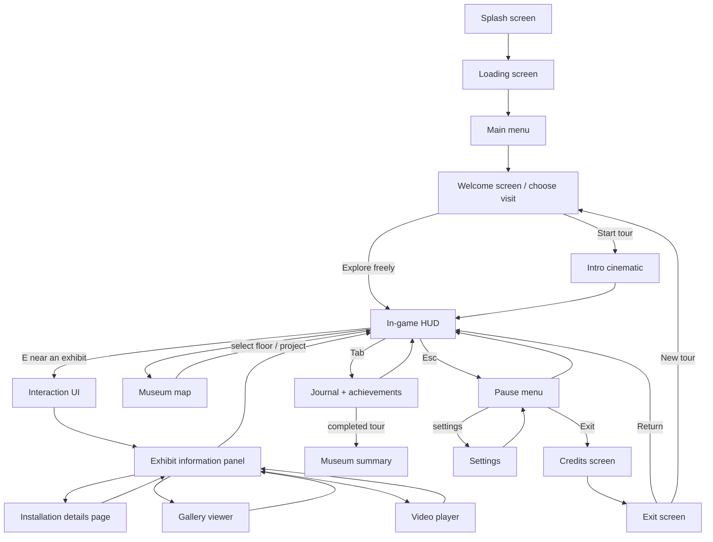

# CFT Kinetic Museum — screen flow

This is the fast path through the experience. Every screen can return to its parent without losing tour progress.

## Screen responsibilities

| Reference screen | Game state | Main action | Return path |
| --- | --- | --- | --- |
| `SPLASH SCREEN` | Initial branding | Wait or continue | Loading |
| `LOADING SCREEN` | Hall/model preparation | Wait for 27-project registry | Main menu |
| `MAIN MENU` | Title screen | Begin, continue, links | Welcome |
| `WELCOME SCREEN` | Visit route chooser | Guided tour or free exploration | Intro/HUD |
| `INTRO CINEMATIC UI` | Opening camera film | Space/click to skip | HUD |
| `HUD (IN GAME)` | Active exploration | WASD, mouse, E, M, Tab, Esc | Any overlay |
| `INTERACTION UI` | Nearby target prompt | Press E | Exhibit panel/map |
| `EXHIBIT INFORMATION PANEL` | Selected project overview | Open details, gallery, video | HUD |
| `INSTALLATION DETAILS PAGE` | Technical/specification tab | Read, switch tabs | Exhibit panel |
| `GALLERY VIEWER` | Drawings and media | Open image, close lightbox | Exhibit panel |
| `VIDEO PLAYER` | Project/showreel media | Play or open external fallback | Exhibit panel |
| `MUSEUM MAP` | Three-floor directory | Select floor or jump to a hall | HUD |
| `ACHIEVEMENT SCREEN` | Journal progress | Review unlocked goals | HUD/summary |
| `PAUSE MENU` | Paused game | Resume, map, journal, settings, exit | HUD |
| `SETTINGS` | Input/audio/graphics | Change a setting | Pause |
| `MUSEUM SUMMARY` | Completion report | Keep exploring or credits | HUD/credits |
| `CREDITS SCREEN` | Credits roll | Continue/skip | Exit |
| `EXIT SCREEN` | Visit statistics | Return or start new tour | HUD/welcome |

## Current implementation notes

- `M` opens the three-floor map; the floor selector groups all 27 halls by gallery tier.
- `Tab` opens the journal and achievement progress.
- `Esc` opens pause; the pause menu contains settings, map, journal, home, and exit.
- `E` opens the focused exhibit, reception, or floor-map interaction.
- The 12 available source models are interactive. The other 15 numbered halls remain visible as clearly marked “model coming soon” displays until their source exports are supplied.
